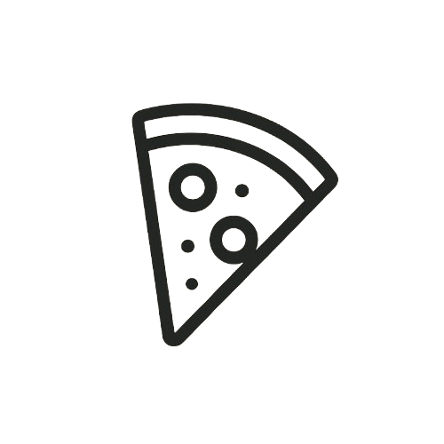

<h1 align="center">
	<br><br>
    Pizza Shop
</h1>

<p align="center">
Dashboard Front-End desenvolvido para uma pizzaria, com visualização de pedidos, status de produtos e gráficos interativos de vendas. Com uma interface intuitiva que facilita o controle operacional e análise de métricas.</p>

<div>
    <p align="center">
    <a href="https://www.linkedin.com/in/yuri-silva99/" target="_blank">
        
    </a>
    <a href="#">
        
    </a>
    <a href="#">
        
    </a>
  <br>
    <a  href="#">
      
    </a>
    </p>
</div>

## Tabela de Conteúdos

<p align="center">
 <a href="#Funcionalidades">Funcionalidades</a> •
 <a href="#Instalação">Instalação</a> • 
 <a href="#Rodando-localmente">Rodando localmente</a> • 
 <a href="#Funcionalidades-futuras">Funcionalidades Futuras</a> • 
 <a href="#Tecnologias">Tecnologias</a> • 
 <a href="#license">Licença</a>
</p>

## 🚀 Funcionalidades

- Lista de Produtos com status de processamento
- Filtros de busca para otimizar a procura
- Gráficos para Receitas Financeiras
- Gráfico com os Produtos mais vendidos
- Edição de Perfil
- Recurso Interface Otimista
- Aplicação de Testes Unitários, E2E e Mocks

*Para novas Funcionalidades verifique a Seção Funcionalidades Futuras*

## 📕 Instalação

Antes de clonar o projeto, certifique que tenha as seguinte ferramentas instaladas em sua máquina: 

**Ferramentas e Links**
- [Node.js](https://nodejs.org/en/)
- [Npm](https://www.npmjs.com/) or [Yarn](https://yarnpkg.com/)

**Recomendações**
- Recomendo utilizar o Editor de Texto VSCode para incrementar esse projeto;

## 💻 Rodando localmente

**Passo 1 - Clone o projeto**
 ```bash
git clone https://github.com/Yuri-stack/pizza.shop
```

Navegue até o diretório principal do projeto 
```bash
cd pizza.shop
```

Abra o projeto no VsCode

```bash
code .
```

**Passo 2 - Instale as dependências**

```bash
npm install
```

ou

```bash
yarn
```

*Tenha certeza que sua internet esteja estável, pois esse processo pode levar um tempo*

**Passo 3 - Configurando as Variáveis de Ambiente**

* Renomeie o arquivo **env.local** para **.env**;
* Preencha as informações do arquivo corretamente;

**Passo 4 - Execute o projeto**

```bash
npm run dev
```
ou

```bash
yarn dev
```

Após os passos anteriores, abra em seu navegador o projeto acessando a endereço: http://localhost:5173


## 🚧 Funcionalidades Futuras

Veja abaixo as próximas Funcionalidades que serão adicionadas ao projeto:

*Aguardamos novas ideias*

## 🌐 Tecnologias

- [React]() - Biblioteca Front-End para construir Aplicações Interfaces Client-Side eficientes e escaláveis;
- [TypeScript]() - Linguagem de Programação fortemente tipada desenvolvida com base no Javascript;
- [Testing-library]() - Ferramenta para Testes Unitários;
- [Mock Service Worker]() - Ferramenta para criar Mocks em aplicações front-end;
- [PlayWright]() - Ferramenta permite a execução de testes E2E em paralelo;

## 📝 Licença

<p align="center">
O projeto Pizza.Shop atualmente está sobre a Licença  <a href="https://choosealicense.com/licenses/mit/">MIT</a> e está aberto para receber implementações de novas funcionalidades de outros devs.  
</p>

<p align="center">
Para constribir, faça um fork do projeto e siga os passos da Seção: Instalação.
</p>

<p align="center">
Feito com 👺 por <a href="https://www.linkedin.com/in/yuri-silva99/">Yuri Oliveira</a>🚀.
</p>
